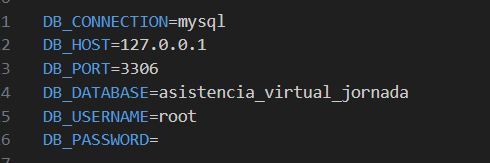

<p align="center">
    
</p>

# APLICACIÓN ASISTENCIA VIRTUAL - UNT

Este sistema se encargará de tomar asistencia a las jornadas virtuales en la Universidad Nacional de Trujillo.

## Requisitos previos
- Se utiliza docker para una mejor uniformización de las herramientas y para homogenizar el setup para los desarrolladores.
- Instalar docker y configurarlo según el S.O. (Tener en cuenta que para **Windows** se deberá configurar WSL).

En el caso que se desee trabajar nativamente, se deberá considerar:
- Tener instalado composer
- Tener instalado npm
  - PHPStorm (opcional)

## Tools
Se ha utilizado:
- PHP 8.1.29
- Laravel v 10.48.14
- Javascript
- Eloquent (ORM)
- MySQL v8.4

## Instalación
La aplicación está dockerizada y usa XDebug para su depuración. Todos los servicios se levantan utilizando:

### 1. Clonar el proyecto en un directorio de trabajo:
Momentáneamente utilizamos el protocolo HTTPS, esperando mejorar a SSH para seguridad.

```
git clone https://github.com/AndersonBH16/asistencia-jornada-virtual.git
```

### 2. Levantar contenedores:
```
docker-compose up -d
```

### 3. Verificar que los contenedores corran óptimamente
```
docker ps
```
Deberá aparecer el siguiente log:


El cual contiene 3 contendores: 
- **asis-jornada-virtual :** Contiene la aplicación construida en PHP con el proyecto laravel
- **asis-jornada.gninx :** Contiene el servidor ngnix
- **asistencia-virtual-jornada :** Contiene la base de datos

### 4. Acceder a los contenedores
```
docker exec -it <<hash o nombre del contenedor>> bash
```

### 5. Apagar los contenedores
```
docker-compose down
```

Apaga todos los contenedores obtenidos a partir del docker-composer

### 6. Instalar dependencias composer
```
composer install
```

### 7. Instalar dependencias npm
```
npm install
```

### 8. Compilar paquetes npm
```
npm run dev
```

### 9. Configurar el archivo .env con el **nombre de la BD**


### 10. Migrar la base de datos
```
php artisan migrate
```

### 11. Para comenzar a usarlo
Laravel es un framework seguro, lo que una vez teniendolo configurado no podremos usarlo aún, para ello debemos ejecutar lo siguiente para tener una key de seguridad para el manejo de datos y sesiones encriptadas:
```
php artisan key:generate
```

### 12. Levantar el proyecto
```
php artisan serve
```
Abrir el navegador y entrar a `localhost:8080`

## Acerca de
Desarrollado por
**OTI - Oficina de Tecnologías de Información** - 2024 - para **UNIVERSIDAD NACIONAL DE TRUJILLO**
